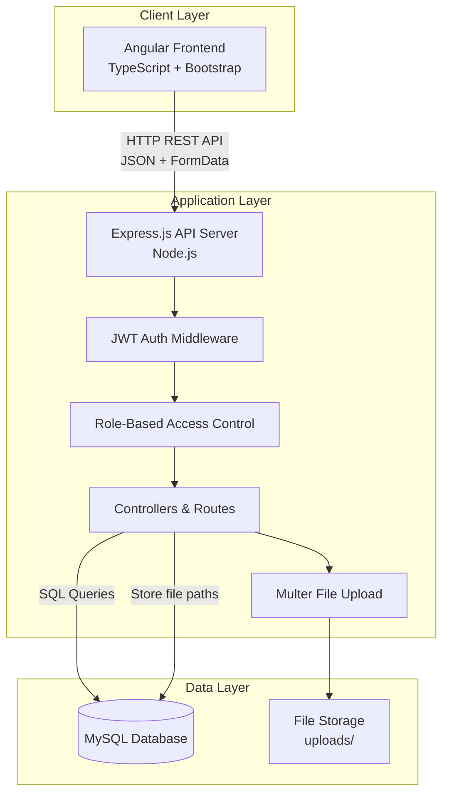
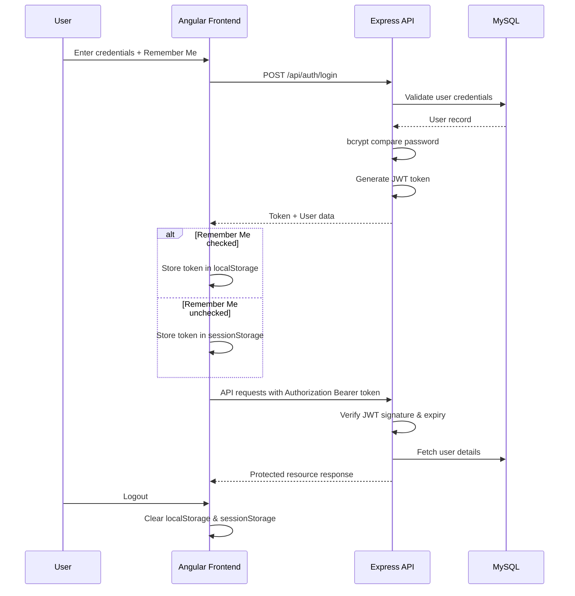
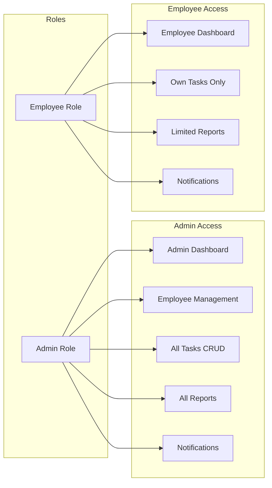
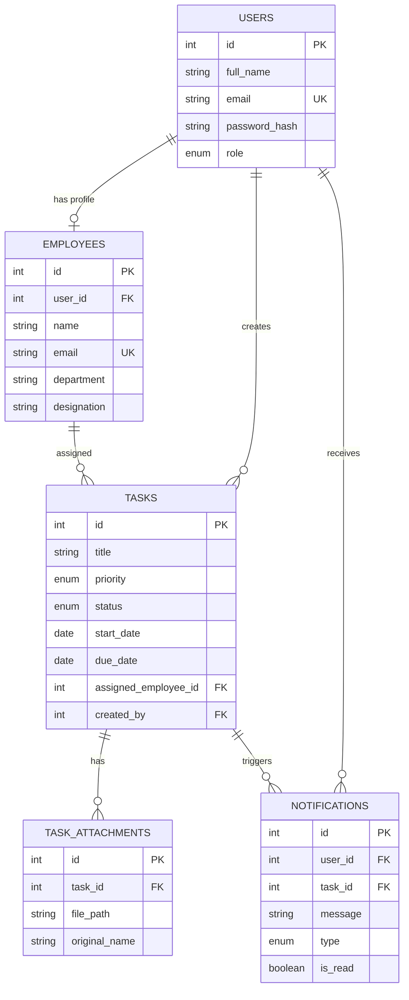
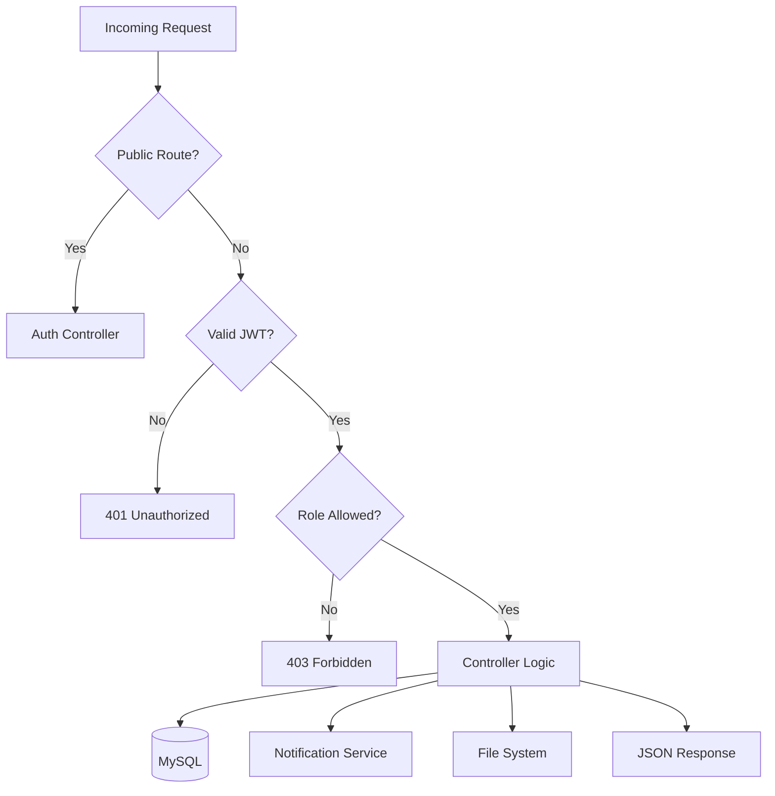

# Architecture - Employee Task Management System

## System Overview

```mermaid
flowchart TB
    subgraph Client["Client Layer"]
        A[Angular Frontend<br/>TypeScript + Bootstrap]
    end

    subgraph Server["Application Layer"]
        B[Express.js API Server<br/>Node.js]
        C[JWT Auth Middleware]
        D[Role-Based Access Control]
        E[Multer File Upload]
        F[Controllers & Routes]
    end

    subgraph Data["Data Layer"]
        G[(MySQL Database)]
        H[File Storage<br/>uploads/]
    end

    A -->|HTTP REST API<br/>JSON + FormData| B
    B --> C
    C --> D
    D --> F
    F --> E
    F -->|SQL Queries| G
    E --> H
    F -->|Store file paths| G
```

## JWT Authentication Flow

```mermaid
sequenceDiagram
    participant U as User
    participant F as Angular Frontend
    participant A as Express API
    participant DB as MySQL

    U->>F: Enter credentials + Remember Me
    F->>A: POST /api/auth/login
    A->>DB: Validate user credentials
    DB-->>A: User record
    A->>A: bcrypt compare password
    A->>A: Generate JWT token
    A-->>F: Token + User data

    alt Remember Me checked
        F->>F: Store token in localStorage
    else Remember Me unchecked
        F->>F: Store token in sessionStorage
    end

    F->>A: API requests with Authorization Bearer token
    A->>A: Verify JWT signature & expiry
    A->>DB: Fetch user details
    A-->>F: Protected resource response

    U->>F: Logout
    F->>F: Clear localStorage & sessionStorage
```

## Role-Based Access Control

```mermaid
flowchart LR
    subgraph Roles
        Admin[Admin Role]
        Employee[Employee Role]
    end

    subgraph AdminAccess["Admin Access"]
        AD[Admin Dashboard]
        EM[Employee Management]
        AT[All Tasks CRUD]
        AR[All Reports]
        AN[Notifications]
    end

    subgraph EmployeeAccess["Employee Access"]
        ED[Employee Dashboard]
        MT[Own Tasks Only]
        ER[Limited Reports]
        EN[Notifications]
    end

    Admin --> AD
    Admin --> EM
    Admin --> AT
    Admin --> AR
    Admin --> AN

    Employee --> ED
    Employee --> MT
    Employee --> ER
    Employee --> EN
```

## Database Entity Relationships

```mermaid
erDiagram
    USERS ||--o| EMPLOYEES : "has profile"
    USERS ||--o{ TASKS : creates
    USERS ||--o{ NOTIFICATIONS : receives
    EMPLOYEES ||--o{ TASKS : assigned
    TASKS ||--o{ TASK_ATTACHMENTS : has
    TASKS ||--o{ NOTIFICATIONS : triggers

    USERS {
        int id PK
        string full_name
        string email UK
        string password_hash
        enum role
    }

    EMPLOYEES {
        int id PK
        int user_id FK
        string name
        string email UK
        string department
        string designation
    }

    TASKS {
        int id PK
        string title
        enum priority
        enum status
        date start_date
        date due_date
        int assigned_employee_id FK
        int created_by FK
    }

    NOTIFICATIONS {
        int id PK
        int user_id FK
        int task_id FK
        string message
        enum type
        boolean is_read
    }

    TASK_ATTACHMENTS {
        int id PK
        int task_id FK
        string file_path
        string original_name
    }
```

## API Request Flow

```mermaid
flowchart TD
    R[Incoming Request] --> P{Public Route?}
    P -->|Yes| H[Auth Controller]
    P -->|No| T{Valid JWT?}
    T -->|No| E401[401 Unauthorized]
    T -->|Yes| RBAC{Role Allowed?}
    RBAC -->|No| E403[403 Forbidden]
    RBAC -->|Yes| C[Controller Logic]
    C --> DB[(MySQL)]
    C --> N[Notification Service]
    C --> FS[File System]
    C --> RES[JSON Response]
```
